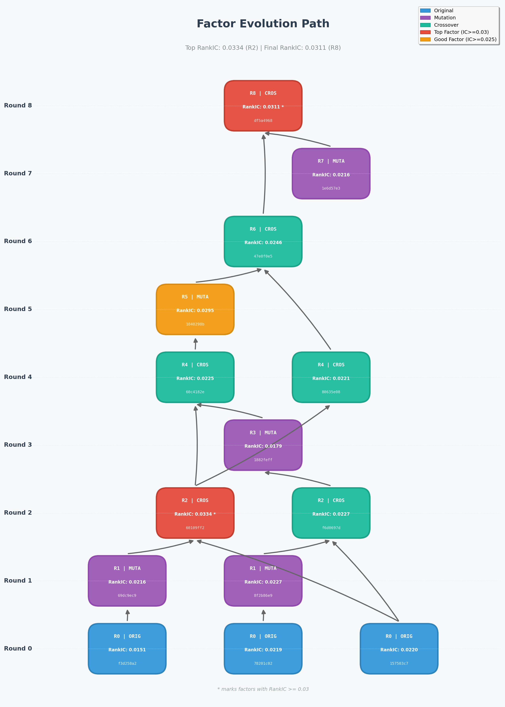
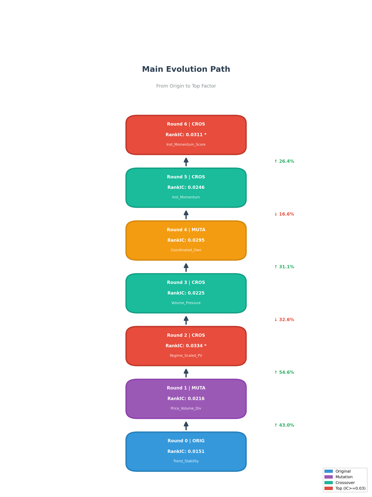

# Factor Evolution Path Case Study

## 📊 Summary

| Metric | Value |
|--------|-------|
| **Top RankIC** | 0.0334 (Round 2, Node `60109ff23988`) |
| **Final RankIC** | 0.0311 (Round 8, Node `df5a496878f4`) |
| **Total Rounds** | 8 |
| **Total Nodes** | 14 |
| **Crossover Count** | 6 |
| **Mutation Count** | 5 |

---

## 🌳 Evolution Path Visualization

### Full Evolution Tree


### Main Path (Simplified)


---

## 📈 Main Evolution Path

```
┌─────────────────────────────────────────────────────────────────┐
│  🌱 Round 0: ORIGINAL                                           │
│     f3d258a2abd1                                                │
│     RankIC: 0.0151                                              │
│     Factor: Trend_Stability_RSQR_10D                            │
└─────────────────────────────────────────────────────────────────┘
                              │
                              ▼ [Mutation]
┌─────────────────────────────────────────────────────────────────┐
│  📊 Round 1: MUTATION                                           │
│     69dc9ec90498                                                │
│     RankIC: 0.0216 (+43%)                                       │
│     Factor: Price_Volume_Divergence_10D                         │
└─────────────────────────────────────────────────────────────────┘
                              │
                              ▼ [Crossover] + 157503c7b942
┌─────────────────────────────────────────────────────────────────┐
│  ⭐ Round 2: CROSSOVER (TOP IC!)                                │
│     60109ff23988                                                │
│     RankIC: 0.0334 (+55%) ← Highest in chain!                   │
│     Factor: Regime_Scaled_Price_Volume_Divergence_10D           │
└─────────────────────────────────────────────────────────────────┘
                              │
                              ▼ [Crossover] + 1882feff9a8c
┌─────────────────────────────────────────────────────────────────┐
│  📊 Round 4: CROSSOVER                                          │
│     60c4182e484c                                                │
│     RankIC: 0.0225 (-33%)                                       │
│     Factor: Volume_Pressure_Volatility_Composite_10D            │
└─────────────────────────────────────────────────────────────────┘
                              │
                              ▼ [Mutation]
┌─────────────────────────────────────────────────────────────────┐
│  📊 Round 5: MUTATION                                           │
│     1040298be838                                                │
│     RankIC: 0.0295 (+31%)                                       │
│     Factor: Coordinated_Ownership_Momentum_20D                  │
└─────────────────────────────────────────────────────────────────┘
                              │
                              ▼ [Crossover] + 80635e08a493
┌─────────────────────────────────────────────────────────────────┐
│  📊 Round 6: CROSSOVER                                          │
│     47e0f0e55382                                                │
│     RankIC: 0.0246 (-17%)                                       │
│     Factor: Institutional_Momentum_Volume_Corr_30D              │
└─────────────────────────────────────────────────────────────────┘
                              │
                              ▼ [Crossover] + 1e6d57e38e89
┌─────────────────────────────────────────────────────────────────┐
│  ⭐ Round 8: CROSSOVER (FINAL)                                  │
│     df5a496878f4                                                │
│     RankIC: 0.0311 (+26%)                                       │
│     Factor: Institutional_Momentum_Score_20D                    │
└─────────────────────────────────────────────────────────────────┘
```

---

## 📝 Key Factor Expressions

### 1. Origin Factor `f3d258a2abd1` (RankIC=0.0151)

```python
# Trend_Stability_RSQR_10D
IF(AND((POW(REGBETA($close, SEQUENCE(10), 10) * 10, 2) / POW(TS_STD($close, 10), 2)) > 0.7, 
       TS_ROC($close, 60) < 0, 
       ABS(TS_ROC($close, 60)) > 0.1), 
   TS_ROC($close, 60), 0)

# Long_Term_Reversal_ROC_60D
TS_PCTCHANGE($close, 60)
```

### 2. Top IC Factor `60109ff23988` (RankIC=0.0334) ⭐

```python
# Regime_Scaled_Price_Volume_Divergence_10D
TS_CORR(DELTA($close, 1)/$close, DELTA($volume, 1)/$volume, 10) 
* IF(TS_MEAN(($high - $low)/$close + TS_STD($return, 5) 
     + ($close - $low)/($high - $low + 1e-8), 5) 
     > TS_PERCENTILE(..., 20, 60), 1.5, 0.5)
```

### 3. Final Factor `df5a496878f4` (RankIC=0.0311) ⭐

```python
# Institutional_Momentum_Score_20D
RANK(TS_CORR(DELTA($close, 1)/$close, DELTA($volume, 1)/$volume, 20) 
     * TS_MEAN(($close - $open)/$close, 5))

# Retail_Herding_Divergence_10D
SIGN(TS_MEAN(($close - $open) / $close, 5)) 
* (TS_MEAN(($high - $low) / $close, 5) 
   - TS_STD(($high - $low) / $close, 10))
```

---

## 🔄 Evolution Pattern Analysis

| Type | Description | Example |
|------|-------------|---------|
| **Mutation** | Small changes to parameters or structure | `f3d258a2abd1` → `69dc9ec90498` |
| **Crossover** | Combine features from two factors | `69dc9ec90498` + `157503c7b942` → `60109ff23988` |

### IC Progression

```
0.0151 (Origin) 
   → 0.0216 (+43%, Mutation) 
   → 0.0334 (+55%, Crossover) ⭐ Peak
   → 0.0225 (-33%, Crossover) 
   → 0.0295 (+31%, Mutation)
   → 0.0246 (-17%, Crossover)
   → 0.0311 (+26%, Crossover) ⭐ Final
```

---

## 📁 Related Files

| File | Description |
|------|-------------|
| `优质因子演化case.json` | Complete evolution tree data |
| `优质因子演化路径图.png` | Full evolution tree visualization |
| `优质因子主路径图.png` | Simplified main path visualization |
| `优质因子演化case示意图.md` | This document |

---

## 🎯 Key Insights

1. **Peak Performance at Round 2**: The highest RankIC (0.0334) was achieved early through crossover of price-volume divergence signals with volatility regime indicators.

2. **IC Fluctuation**: Evolution doesn't always improve IC - some crossover operations reduced performance temporarily before subsequent improvements.

3. **Final Factor Characteristics**: The final factor (RankIC=0.0311) combines institutional momentum signals with volume-price correlation, showing stable predictive power.

4. **Evolution Depth**: 8 rounds of evolution involving 6 crossovers and 5 mutations led to the final high-quality factor.
